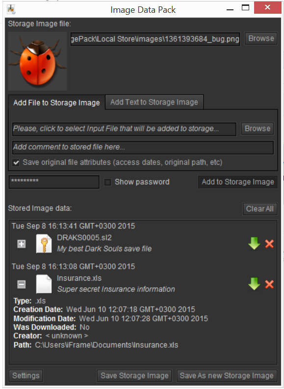
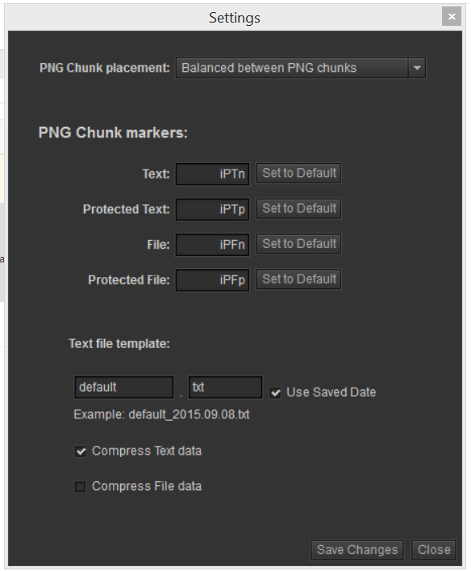
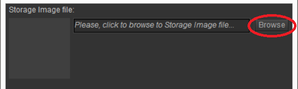
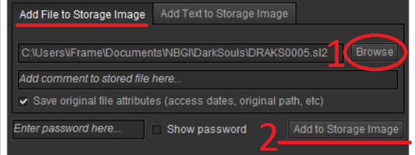
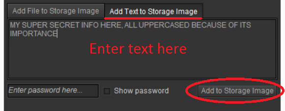
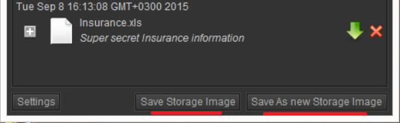
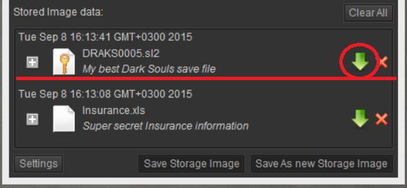
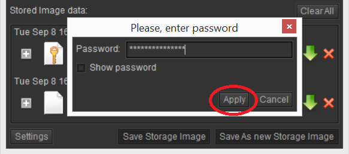
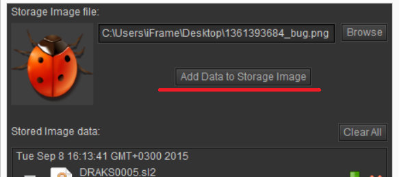

#Image Data Pack
  
This is an open-source application based on  Adobe AIR runtime. It allows to save your custom data into PNG image file and restore it back from image.  
  
[Download Image Data Pack installation file](https://github.com/burdiuz/png-pack/raw/master/ImagePack.air)  
> **Note:** This is cross-platform application that can be installed on Windows, Mac or Linux machine, but you will need to have [Adobe AIR runtime](https://get.adobe.com/air/) installed before installing User-Agent Comparer application. [Download Adobe AIR runtime](https://get.adobe.com/air/)
  
Main window of the application  
  
Advanced user can change storage settings  
  
> **Note:** This application uses XOR encryption if password was entered. This is weak type of encryption and if you want to really encrypt data, please, use other application for this.
  
###How to use
####To add data to the image
1. Select image file by clicking "Browse" button, this image is named "Storage Image" in this application because it will store all the data you want to hide. After loading image you should see it on the top left corner of application window.   
2. Dependent on what you want to save -- file or plain text select tab "Add file to Storage Image"  or "Add Text to Storage Image".  
3. Under this tab select file with "Browse" button or enter text into text field. For file you can add comment and select checkbox to "Save original file attributes".    
4.  If you want to encrypt data, specify password in *Enter password here...* field. Encrypted data will be displayed with "key" image over file icon.  
5. Click on "Add to Storage Image" button to add selected file or entered text to the image.  
6. To add new file or text repeat from step 2.  *Note: You can add data to image that already stores data.*  
7. Click on "Save Storage Image" button to save selected data to current image file or "Save As new Storage Image" to save Storage Image and data into another file, in this case original file will remain unchanged.  *Note: Nothing will be changed in the Storage Image before you click "Save Storage Image" or "Save As new Storage Image". "Save Storage Image" will update original image file!*  
  
####To restore data from the image
> **Note:** If you have data added to the list, click on "Clear All" button, to remove files and text from the list. Otherwise loaded Storage Image will will mix own data with current list.  
  
1. Click on "Browse" button on top right of the application window and select Storage Image file that was previously saved with data you want to retrieve. After loading image you will see list of data stored in this image.   
2. Click on green arrow "Download" button for file you want to retrieve.   
3. If Password request, enter password and save file.   
  
> **Note:** If you want to add more data to Storage Image, select it, then click on "Add data to Storage Image" button.   
  
###Resources used in this application  
[Adobe Flex SDK 4](http://www.adobe.com/devnet/flex/flex-sdk-download.html)  
Application skin [Kingnare style](http://code.google.com/p/kingnarestyle/)  
Icons from http://www.iconfinder.com/  
  
> Written with [StackEdit](https://stackedit.io/).